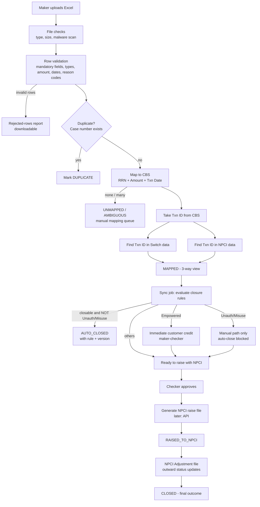
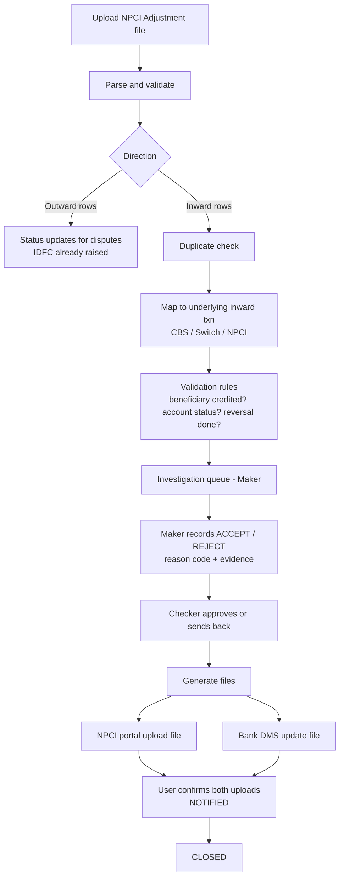
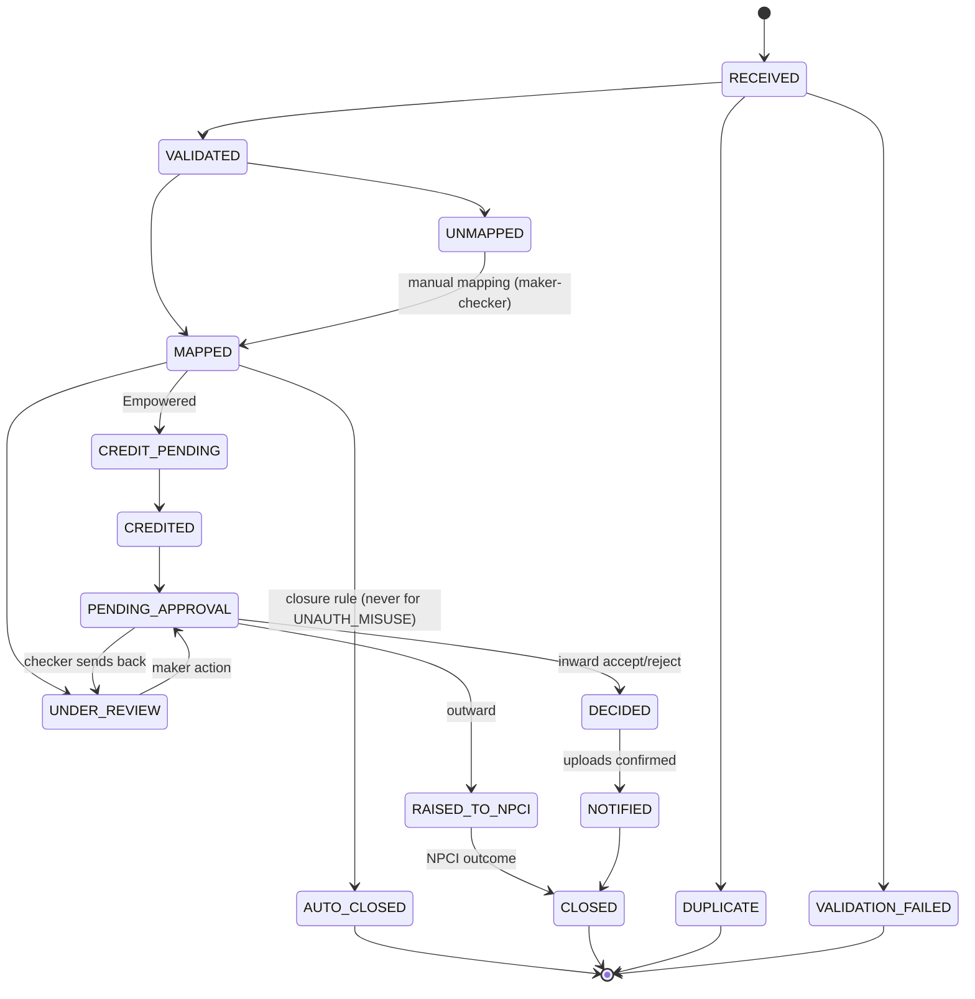
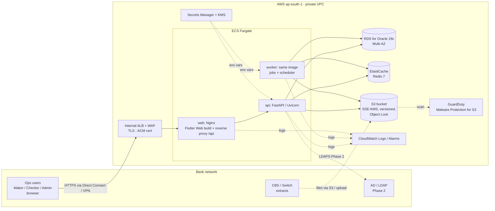
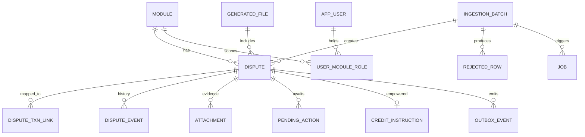
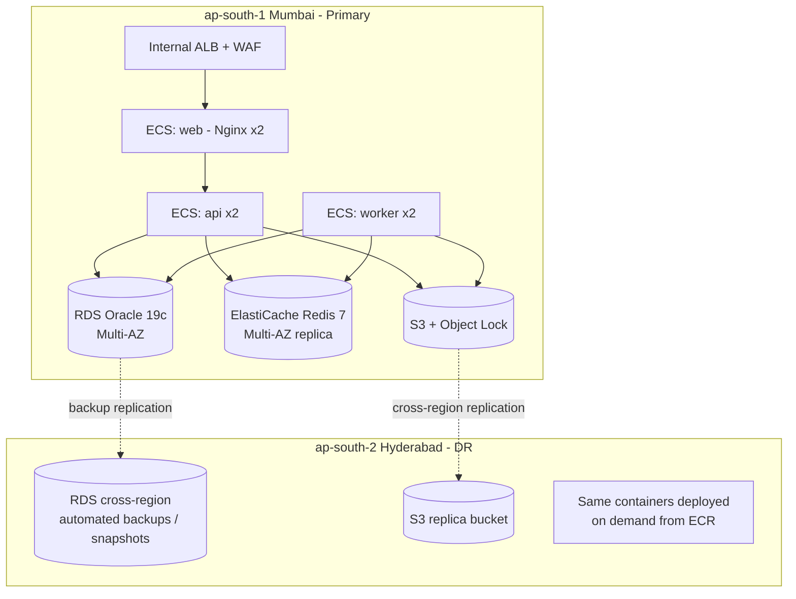

# Dispute Management System (DMS) — Architecture

| | |
|---|---|
| **Status** | Draft v0.3 — scaffold built (login, logout, home) |
| **Source of truth for technology** | [`TECH_STACK.md`](TECH_STACK.md). This document applies it to the dispute domain. |
| **Dependency checklist** | [`DEPENDENCIES.md`](DEPENDENCIES.md) |
| **Phase 1 scope** | UPI module, full dispute lifecycle (Outward + Inward) |
| **Future modules** | IMPS, AEPS, E-Toll (FASTag/NETC), others |
| **Hosting** | AWS, ap-south-1 (Mumbai); DR in ap-south-2 (Hyderabad) |
| **Author** | Pranav B (with Claude) |

**Changes from v0.1:** aligned to `TECH_STACK.md`:
- **Stack:** Oracle 19c replaces PostgreSQL, and JWT HS512 issued by the backend replaces Keycloak. The folder layout is now api/services/repositories.
- **Hosting:** AWS instead of on-prem.
- **Background jobs:** an Oracle job table with Redis instead of Celery/RabbitMQ (approved).
- **Storage:** S3 replaces MinIO (approved).
- **Login:** dev-only local login now, LDAP in Phase 2.
- **Token handling:** defined in §9.2.
- **Removed:** Polars, structlog, Prometheus/Grafana, ClamAV and Vault.

---

## 1. Goals and constraints

1. Manage the full dispute lifecycle for UPI first. Build the core so IMPS, AEPS and E-Toll plug in as **modules**, not rewrites.
2. Handle **5,000 disputes/day per product** (≈25k/day at 5 products), plus the much larger reference data (CBS, Switch, NPCI) used for matching.
3. Role-based access (**Admin, Maker, Checker**) assigned **per module**. A user can be a Maker for UPI and a Checker for IMPS.
4. Ingestion: **(a) Excel upload from the UI** now, **(b) inbound REST API** later. Both use the same pipeline.
5. Output: **Excel / CSV export** now, **outbound API calls** to external systems later.
6. Bank-grade controls: maker-checker on every state-changing decision, an immutable audit trail, PII encryption (AES-256-GCM), data kept in India.
7. Technology is fixed by `TECH_STACK.md`: FastAPI · Python 3.12 · SQLAlchemy 2 · python-oracledb · Oracle 19c · Redis 7 · JWT HS512 · AES-256-GCM · Flutter · Nginx · Uvicorn · pytest · Docker · Git. **Approved additions:** AWS hosting, S3 storage, and the Oracle-job-table background worker.

---

## 2. Process analysis

### 2.1 Definitions

| Term | Meaning |
|---|---|
| **Outward dispute** | Raised by an IDFC customer (remitter) about an **outward** transaction from IDFC to another bank. IDFC raises the dispute with NPCI. |
| **Inward dispute** | Raised by another bank's customer against IDFC about an **inward** transaction to IDFC. IDFC must investigate and **Accept / Reject**. |
| **Case number** | Unique business key of a dispute; used for duplicate detection. |
| **RRN** | Retrieval Reference Number of the original transaction. |
| **Txn ID** | UPI transaction ID. It is the join key across CBS, Switch and NPCI. |

### 2.2 Outward dispute lifecycle



| # | Stage | Key design points |
|---|---|---|
| 1 | **Upload** | Browser → Nginx → FastAPI, which streams the file to S3 untouched (evidence) and records its SHA-256 checksum. A byte-identical re-upload is rejected. Processing is **asynchronous**: the UI gets a `batch_id` and polls progress. |
| 2 | **Validation** | Rules are **config-driven per module** (column → validator). Invalid rows are kept with error codes and can be downloaded. The batch policy (**all-or-nothing** or **partial accept**) needs a business decision. |
| 3 | **Duplicate check** | Unique constraint on `(module_code, case_number)`. Duplicates are recorded (not dropped) and linked to the original. Duplicates *within the same file* are also caught. |
| 4 | **Mapping** | Set-based SQL per batch, not row-by-row Python (see §5.4). Step 1: CBS on `(rrn, amount, txn_date)`, with a configurable ±1-day tolerance. Step 2: `txn_id` → Switch and NPCI. Outcomes: `MAPPED`, `PARTIALLY_MAPPED`, `UNMAPPED`, `AMBIGUOUS`. Anything not `MAPPED` goes to a manual mapping queue. |
| 5 | **Sync job** | A scheduled and on-demand background job evaluates the **closure rules** (e.g., reversal already posted in CBS, NPCI shows beneficiary credited, customer already refunded). Every auto-close records *which rule and which version* fired. |
| 6 | **Empowered** | **Immediate credit** to the customer. This is money movement, so it is **idempotent** (at most one credit per dispute), goes through **maker-checker** (unless the business approves straight-through), posts to CBS through its posting interface, and is fully audited. |
| 7 | **Unauth / Misuse** | A **hard guard**. The transition to `AUTO_CLOSED` is refused in the service layer **and** by an Oracle check constraint (§5.5). |
| 8 | **Raise to NPCI** | Only checker-approved disputes. The system generates the file in NPCI's format, stores it in S3 with a checksum, and moves the disputes to `RAISED_TO_NPCI`. |

### 2.3 Inward dispute lifecycle



- **One NPCI Adjustment file feeds both flows.** Inward rows create inward disputes. Outward rows update disputes IDFC already raised (loop-back to §2.2 stage 8).
- The NPCI portal and bank DMS take **manual file uploads**. The system therefore produces the files and records an explicit **"uploaded by <user> at <time>" confirmation**. Without that record, TAT compliance cannot be proved.
- A decision cannot be approved without a reason code and supporting evidence.

### 2.4 Dispute state machine (shared by all modules)



The state machine is **table-driven**. The `state_transition` config per module holds: from, to, allowed role, whether a checker is needed, and a guard function. IMPS and AEPS reuse the engine with their own transitions.

### 2.5 Questions to settle before build

| # | Question | Why it matters |
|---|---|---|
| Q1 | Exact **input Excel layout** for outward disputes and the **NPCI Adjustment file** layout (columns, header/trailer, encoding). Masked samples needed. | Parsers and validators are built from these. |
| Q2 | Full **closure-rule list** for the sync job, signed off by Operations. | These rules auto-close customer complaints, which is a regulatory risk. |
| Q3 | How **CBS / Switch / NPCI** data arrives: full daily files, targeted extracts, or DB views? How many days back (look-back window)? Daily row counts? | Drives Oracle storage, the partitioning decision (§7.1) and matching speed. |
| Q4 | How the **Empowered credit** is posted: CBS API, CBS bulk file, or manual? Straight-through or checker-approved? | Money movement: idempotency and reconciliation. |
| Q5 | **TAT / SLA** per dispute type and reason code (NPCI UDIR/URCS timelines, RBI TAT harmonisation and compensation). | SLA timers, ageing, escalation, compensation. |
| Q6 | Unauth/Misuse: other obligations (e.g., RBI limited-liability shadow-credit timelines)? | May need a second mandatory workflow. |
| Q7 | Must the checker always differ from the maker? Amount thresholds for second-level approval? | Maker-checker rules. |
| Q8 | Data retention and archival period. | S3 lifecycle, Oracle purge design. |
| Q9 | **Oracle licence on AWS:** SE2 License Included, or EE BYOL with the Partitioning option? | See §7.1. |
| Q10 | **Network:** will users reach the app over Direct Connect / VPN from the bank network (internal-only)? How will CBS/Switch extracts and (Phase 2) AD/LDAP be reached from AWS? | VPC design, load balancer type, LDAP phase. |
| Q11 | Has the bank's **cloud / IT-outsourcing approval** (RBI outsourcing and payment-data localisation requirements) been obtained for this workload on AWS? | Go-live gating item. |
| Q12 | Which **CI/CD tool** and **infrastructure-as-code** tool does the bank use (Jenkins, GitLab, GitHub Actions, CodePipeline; Terraform or CloudFormation)? Neither is in `TECH_STACK.md`. | Pipeline and environment build. |
| Q13 | Formats and targets for the future outbound API (CRM, complaint system, CBS)? | Outbox design. |

---

## 3. Volume and sizing

| Item | Estimate | Design implication |
|---|---|---|
| Disputes | 5k/day/product → ~25k/day → ~9M/year | Small for Oracle with the right indexes |
| Excel upload | ~5k rows per file | openpyxl reads 5k rows in ~0.2 s (measured). Parse in the worker, never in the request |
| Reference data (CBS/Switch/NPCI) | Possibly **millions of rows/day** per source if full files are loaded | The real volume driver. Bulk-insert with `executemany` array binding; retention = look-back window (§7.1) |
| Concurrent users | ~50–200 ops users | 2 API containers are enough; correctness matters more than scale |
| Batch target | Upload → validated → mapped for 5k rows in **< 2 min** | Set-based SQL + background worker |
| Availability | 99.5%+ business hours; DR required | RDS Multi-AZ; cross-region backups |
| RPO / RTO | RPO ≤ 15 min, RTO ≤ 4 h (to confirm) | RDS automated backups + cross-region replication |

**Conclusion: a modular monolith.** One FastAPI codebase and one Docker image, run as two processes: **api** and **worker**. Nginx is a third container. This is simpler to secure, audit and support than microservices. Module boundaries (`upi`, `imps`, …) are kept clean so a split is possible later.

---

## 4. Target architecture on AWS

### 4.1 Logical view



### 4.2 Components

| Component | Technology | Notes |
|---|---|---|
| Client | Flutter Web (stable) | Only approved client. Served as static files by Nginx. §11 |
| Reverse proxy | Nginx (stable), container | TLS from ALB, security headers, `client_max_body_size`, serves the Flutter build, proxies `/api/` to Uvicorn. FastAPI is never exposed directly |
| API | FastAPI on Uvicorn, Python 3.12 | REST/JSON, `/api/v1/…`, OpenAPI docs (disabled or protected in production) |
| Worker | Same image, `python -m app.worker` | Runs background jobs and the scheduler (§6). No extra framework |
| Database | Oracle 19c on **Amazon RDS for Oracle**, Multi-AZ | SQLAlchemy 2.x + python-oracledb (thin mode) |
| Cache | Redis 7 on **Amazon ElastiCache** (Redis OSS 7.x) | Caching, rate limits, locks, refresh-token store, access-token deny-list, job progress. Never the source of truth |
| File storage | **Amazon S3** | Uploads, NPCI files, exports, evidence (§8) |
| Malware scan | **GuardDuty Malware Protection for S3** | Scans every upload; the worker waits for a clean result |
| Secrets | **AWS Secrets Manager** → container env vars | `DATABASE_PASSWORD`, `JWT_SECRET`, `AES_ENCRYPTION_KEY`… (matches `TECH_STACK.md` §18) |
| Logs / metrics | **CloudWatch** | JSON logs from stdout; alarms (§12) |

---

## 5. Backend design

### 5.1 Code structure (follows `TECH_STACK.md` §5)

Each product module is a **sub-package inside each layer**, and shared engine code lives in `common`. Adding IMPS means adding `imps/` folders, not changing the engine.

```
backend/
├── app/
│   ├── main.py                    # FastAPI app factory, middleware, exception handlers
│   ├── worker.py                  # worker entrypoint: job loop + scheduler (§6)
│   ├── api/
│   │   ├── dependencies.py        # current_user, require_permission(module, perm), db session
│   │   ├── router.py
│   │   └── v1/
│   │       ├── auth.py            # login, refresh, logout, me
│   │       ├── admin/             # users, module roles, rule parameters, masters
│   │       ├── common/            # batches, jobs, files/downloads, approvals, audit
│   │       └── upi/               # disputes, uploads, mapping, decisions, npci files, reports
│   ├── core/
│   │   ├── config.py              # pydantic-settings, per-environment
│   │   ├── security.py            # JWT HS512, password hashing (dev), token helpers
│   │   ├── crypto.py              # AES-256-GCM field encryption + blind index
│   │   ├── responses.py           # standard response envelope (TECH_STACK §11)
│   │   ├── exceptions.py          # AppError hierarchy → error_code mapping
│   │   └── logging.py             # JSON log formatter, request-id context
│   ├── models/        common/  upi/     # SQLAlchemy entities
│   ├── schemas/       common/  upi/     # Pydantic request/response models
│   ├── repositories/  common/  upi/     # all SQL lives here
│   ├── services/
│   │   ├── common/                # auth, rbac, maker_checker, workflow, audit,
│   │   │                          # ingestion, export, job, storage, sla, outbox
│   │   └── upi/                   # validation, matching, closure_rules, empowered_credit,
│   │                              # npci_files, adjustment_file, inward_decision
│   ├── jobs/
│   │   ├── registry.py            # job_type → handler (a service call)
│   │   └── handlers/  common/ upi/
│   ├── db/            database.py  session.py
│   ├── cache/         redis.py
│   ├── storage/       base.py  s3.py  local.py   # S3 in AWS, local folder in development
│   └── utils/
├── migrations/                     # Alembic
├── tests/                          # unit/  service/  repository/  api/
├── pyproject.toml
├── Dockerfile
└── README.md
```

Layer rules (from `TECH_STACK.md` §5 and §27): routers handle HTTP only, services hold business rules, repositories hold all SQL, schemas are the API contract, and models are never returned directly. Job handlers are thin: they call services exactly like routers do.

Each module registers a **`ModuleDefinition`** (file specs, validators, matching steps, closure rules, workflow transitions, NPCI file formats) in `services/common/module_registry.py`.

### 5.2 API conventions

- All routes are under `/api/v1/`. Module routes use `/api/v1/{module}/…`, e.g. `/api/v1/upi/disputes`.
- **Response envelope** per `TECH_STACK.md` §11. Lists are paginated:

```json
{
  "success": true,
  "data": { "items": [ ... ], "page": 1, "page_size": 50, "total": 4821 },
  "message": null
}
```

- Errors carry `error_code` values such as `DUPLICATE_CASE`, `INVALID_STATE_TRANSITION`, `SELF_APPROVAL_NOT_ALLOWED`, `STALE_VERSION` (409) and `FILE_REJECTED_MALWARE`.
- Long operations return **202 Accepted** with a `job_id` / `batch_id`. The client polls `GET /api/v1/jobs/{id}`.
- Database work uses **synchronous SQLAlchemy** in plain `def` endpoints (FastAPI runs them in its thread pool). This is simpler and well-proven with python-oracledb; async adds complexity with no benefit at ~200 users.

### 5.3 Ingestion pipeline (Excel now, API later)

```
Source: Excel upload | future REST API
  → API: create ingestion_batch (status RECEIVED), stream file to S3 (uploads/…), enqueue INGEST job
  → worker INGEST job:
      1. wait for GuardDuty scan tag = NO_THREATS_FOUND (else reject batch, alert)
      2. stream-parse with openpyxl (read_only) → validate rows (module validators)
      3. bulk insert valid rows into staging (executemany, array binding, batches of 5,000)
      4. dedup: SQL anti-join on (module_code, case_number) + in-file duplicates
      5. promote to dispute (INSERT … SELECT), write rejected_row records
      6. enqueue MATCH job
```

- The **future inbound API** (`POST /api/v1/{module}/disputes:bulk`) creates the same `ingestion_batch` with `source = 'API'`. It requires an `Idempotency-Key` header, has per-client rate limits in Redis, and authenticates machine clients (to be designed with the partner). It is the same pipeline, not a second code path.

### 5.4 Matching (Oracle 19c SQL, set-based)

Reference tables `ref_cbs_txn`, `ref_switch_txn` and `ref_npci_txn` are indexed on:
- CBS: `(rrn, txn_date, amount)` and `(txn_id)`
- Switch / NPCI: `(txn_id)`

Oracle 19c has no `UPDATE … FROM`, and `MERGE` fails when one dispute matches several source rows (ORA-30926). Matching is therefore done in two steps: collect the candidates, then resolve them.

```sql
-- Step 1: collect CBS candidates for the batch
INSERT INTO dispute_match_candidate (dispute_id, source, ref_id)
SELECT d.id, 'CBS', c.id
FROM   dispute d
JOIN   ref_cbs_txn c
       ON  c.rrn = d.rrn
       AND c.amount = d.amount
       AND c.txn_date BETWEEN d.txn_date - :tol_days AND d.txn_date + :tol_days
WHERE  d.batch_id = :batch_id;

-- Step 2: resolve. Exactly one candidate → MAPPED; more than one → AMBIGUOUS; none → UNMAPPED
MERGE INTO dispute d
USING (SELECT dispute_id, MIN(ref_id) AS ref_id, COUNT(*) AS n
       FROM dispute_match_candidate
       WHERE source = 'CBS' AND dispute_id IN (SELECT id FROM dispute WHERE batch_id = :batch_id)
       GROUP BY dispute_id) m
ON (d.id = m.dispute_id)
WHEN MATCHED THEN UPDATE SET
     d.cbs_ref_id = CASE WHEN m.n = 1 THEN m.ref_id END,
     d.map_status = CASE WHEN m.n = 1 THEN 'CBS_MAPPED' ELSE 'AMBIGUOUS' END;
```

Then `txn_id` is copied from the CBS row, and the same pattern runs against Switch and NPCI on `txn_id`. All SQL uses bind variables and lives in `repositories/upi/matching_repository.py`. Results are stored in `dispute_txn_link`, which drives the **3-way CBS / Switch / NPCI view** in the UI.

### 5.5 Rules (validation and closure)

- Rules are **Python functions in a registry**, each with a code, version, module and description, plus an enabled flag and parameters in Oracle (`rule_config`). Admins can enable or disable rules and change parameters (tolerances, thresholds) via maker-checker; they **cannot write code**. Auditors accept versioned, code-reviewed rules more easily than a free-form rule builder.
- The closure engine always evaluates the category guard first:

```python
if dispute.category is DisputeCategory.UNAUTH_MISUSE:
    return ClosureDecision.no_auto_close("UNAUTH_MISUSE_GUARD")   # never overridable
```

- Plus a database-level second line of defence:

```sql
ALTER TABLE dispute ADD CONSTRAINT chk_no_autoclose_unauth
  CHECK (NOT (category = 'UNAUTH_MISUSE' AND status = 'AUTO_CLOSED'));
```

### 5.6 Maker-checker (generic)

- Every state-changing business action (decision, manual mapping, Empowered credit, raise to NPCI, rule change, role change) creates a `pending_action` holding the payload, maker, target entity and the entity's `version`.
- The checker approves or rejects it. **Checker ≠ maker** is enforced in the service layer. On approval, the change is applied in **one transaction** with **optimistic locking** (`WHERE id = :id AND version = :v`). A stale approval fails with `409 STALE_VERSION`.
- Bulk approval (e.g., 500 items) runs as a background job with a result per item.

### 5.7 Output: exports, NPCI files, outbound API

- **Exports** (CSV via the `csv` module, Excel via openpyxl write-only mode) run as background jobs. The file goes to S3 `exports/` and the user downloads it through the API, so every download is authorised and audited. **Formula injection is neutralised**: cells starting with `= + - @` are prefixed with `'`.
- **NPCI files** have format-specific writers per module (`services/upi/npci_files.py`), tested against golden sample files.
- **Outbound API (later):** **transactional outbox**. The state change and an `outbox_event` row commit in the same transaction. A worker job delivers the event with httpx2, retries with backoff, marks failures as dead-letter and offers a replay screen.

### 5.8 Audit

- `audit_log` is append-only. It records who, what, when, IP, before/after values (sensitive fields masked) and the request ID. Each row stores a **SHA-256 hash of the previous row's hash plus its own content** (tamper-evident chain). The application's Oracle user has `INSERT`/`SELECT` only on this table.
- Every file in or out has its checksum stored in Oracle and is kept immutable in S3 (Object Lock).

---

## 6. Background processing (approved design)

No extra framework. **Oracle is the durable queue, Redis only speeds things up, and the worker is the same codebase in a second container.**

### 6.1 Tables

| Table | Key columns |
|---|---|
| `job` | id, job_type, queue, payload (CLOB, IS JSON), status (QUEUED / RUNNING / DONE / FAILED / CANCELLED), priority, attempts, max_attempts, run_after, locked_by, lease_until, dedup_key, last_error, created_by, timestamps |
| `job_schedule` | id, job_type, payload, schedule (interval seconds **or** daily time IST), next_run_at, enabled |

A function-based unique index stops the same work being queued twice, for example two sync jobs for UPI at once:

```sql
CREATE UNIQUE INDEX ux_job_active_dedup ON job
  (CASE WHEN status IN ('QUEUED','RUNNING') THEN dedup_key END);
```

### 6.2 Worker loop

1. **Claim a job atomically** (optimistic claim, safe across several workers):
   ```sql
   UPDATE job SET status = 'RUNNING', locked_by = :worker, attempts = attempts + 1,
                  lease_until = SYSTIMESTAMP + NUMTODSINTERVAL(:lease_s, 'SECOND')
   WHERE id = (SELECT id FROM (SELECT id FROM job
                               WHERE status = 'QUEUED' AND queue = :queue AND run_after <= SYSTIMESTAMP
                               ORDER BY priority, id)
               WHERE ROWNUM = 1)
     AND status = 'QUEUED'
   RETURNING id INTO :claimed_id;
   ```
   If 0 rows are updated, another worker won the race and this one simply tries again. *(Avoid `FOR UPDATE SKIP LOCKED` combined with `FETCH FIRST`; Oracle rejects it with ORA-02014.)*
2. Run the handler. It calls services and uses its own transactions. **Handlers must be idempotent**, because a job may run twice after a crash.
3. A heartbeat extends `lease_until` for long jobs.
4. On success → `DONE`. On error → back to `QUEUED` with exponential backoff in `run_after` while `attempts < max_attempts`, otherwise `FAILED` plus a CloudWatch alarm.
5. A **reaper** step returns `RUNNING` jobs whose lease expired (the worker died) to `QUEUED`.

### 6.3 Scheduler (sync job, SLA checks, cleanup)

Every worker checks `job_schedule` every ~30 s. A due schedule is claimed with an optimistic update, `UPDATE job_schedule SET next_run_at = :next WHERE id = :id AND next_run_at = :old`. The single winner enqueues the job **in the same transaction**, so each run is enqueued exactly once, however many workers there are.

### 6.4 What Redis does here

| Use | Detail |
|---|---|
| Wake-up signal | The API `LPUSH`es a wake key after enqueueing; workers `BRPOP` with a timeout, so jobs start in milliseconds instead of waiting for the next poll |
| Live progress | `job:{id}:progress` counters (TTL 1 day) for the upload progress bar; the final counts are saved in Oracle |
| Locks | Short `SET NX PX` locks where a job must not overlap an admin action |

If Redis is down, jobs still run: workers fall back to polling every few seconds.

### 6.5 Queues and scaling

- `ingest` (upload parsing, matching, sync, NPCI file generation) and `light` (exports, notifications, outbox).
- Phase 1: one ECS worker service, 2 tasks, each running one job at a time per queue. Scale the task count if queues back up; a CloudWatch alarm fires on queue depth.

---

## 7. Data layer (Oracle 19c)

### 7.1 RDS for Oracle — licence and partitioning decision (Q9)

On Amazon RDS for Oracle, **License Included is only available for Standard Edition 2**. **Enterprise Edition is Bring-Your-Own-Licence only.** The **Partitioning option is an extra-cost EE option.**

| Option | Impact on the design |
|---|---|
| **EE BYOL + Partitioning** (if the bank has spare licences) | Interval partitioning: `dispute` monthly by `created_at`; `ref_*_txn` daily by `txn_date`. Purging old reference data = drop partition (instant) |
| **SE2 License Included** (simplest to procure) | No partitioning. Disputes are fine unpartitioned (≈9M rows/year with good indexes). For **reference data**, use a **rolling set of monthly tables** (`ref_cbs_txn_2026_09`, …) behind a `UNION ALL` view, created and dropped by a scheduled job. Drop-table purges stay instant. SE2 is also limited in CPU threads, which is sufficient for this load |

The repository layer hides whichever option is chosen, so services do not change. **Decide after Q3** (reference-data volumes) is answered.

### 7.2 Core data model



| Table | Key columns | Notes |
|---|---|---|
| `module` | code (UPI, IMPS, AEPS, ETOLL), name, enabled, config (IS JSON) | |
| `app_user` | id, username, display_name, email, status, auth_source (LOCAL/LDAP), password_hash (LOCAL only, dev) | Access only after a module role is assigned |
| `user_module_role` | user_id, module_code, role (ADMIN/MAKER/CHECKER), valid_from/to | **Module-scoped RBAC**. Changes via maker-checker |
| `ingestion_batch` | id, module_code, source (UI/API), s3_key, sha256, scan_status, counts, status | |
| `dispute` | id, module_code, direction (IN/OUT), case_number, rrn, txn_id, amount (NUMBER(15,2)), txn_date, category, reason_code, status, sla_due_at, assigned_to, **version**, customer_account_enc, customer_account_bidx, mobile_enc, module_attrs (IS JSON) | Unique `(module_code, case_number)` |
| `dispute_match_candidate`, `dispute_txn_link` | dispute_id, source, ref_id, match_rule | Matching work table + final 3-way links |
| `dispute_event` | dispute_id, from_status, to_status, actor, reason, at | Full lifecycle history |
| `pending_action` | id, action_type, entity, entity_version, payload, maker, checker, status | Generic maker-checker |
| `credit_instruction` | dispute_id (**unique**), amount, cbs_ref, status | Idempotent Empowered credit |
| `rule_config` | rule_code, version, module_code, params (IS JSON), enabled | |
| `generated_file` | file_type (NPCI_RAISE, NPCI_RESPONSE, BANK_DMS, EXPORT), s3_key, sha256, upload_confirmed_by/at | Tracks manual portal uploads |
| `job`, `job_schedule` | see §6 | |
| `outbox_event` | id, event_type, payload, target, attempts, status | Future outbound API |
| `audit_log` | …, prev_hash, row_hash | Tamper-evident |
| `ref_cbs_txn`, `ref_switch_txn`, `ref_npci_txn` | see §7.1 | Retention = look-back window |

### 7.3 Oracle 19c conventions

- **Primary keys:** `NUMBER GENERATED ALWAYS AS IDENTITY`. **Booleans:** `NUMBER(1)` with a check constraint (19c has no BOOLEAN column type). **JSON:** `CLOB` with an `IS JSON` check (the native JSON type arrives in 21c).
- **Timestamps:** stored in UTC (`TIMESTAMP`) and displayed in IST. **Business dates** (`txn_date`) are `DATE` in IST.
- **Amounts:** `NUMBER(15,2)`, mapped to Python `Decimal` and never `float`.
- Bind variables everywhere. Bulk loads use `executemany` with `batcherrors=True` so bad rows are reported, not fatal.
- **No features newer than 19c.** This matters because developers use Oracle XE 21 locally; CI must also run against a 19c database (RDS test instance).
- Migrations use Alembic. Review generated scripts by hand; autogenerate does not understand every Oracle DDL feature (e.g., function-based indexes).

---

## 8. File storage (Amazon S3) — approved

| Aspect | Design |
|---|---|
| Bucket | One per environment, e.g. `dms-prod-files-ap-south-1`. Block Public Access on; access only through the VPC gateway endpoint; bucket policy denies non-TLS requests |
| Prefixes | `uploads/` (raw uploads) · `npci/outbound/` · `npci/inbound/` · `exports/` · `evidence/` |
| Encryption | SSE-KMS with a customer-managed key |
| Immutability | Versioning on. **Object Lock** (governance or compliance mode, retention per Q8) on `uploads/`, `npci/` and `evidence/`, so evidence files cannot be altered or deleted early |
| Lifecycle | `exports/` expire after e.g. 30 days. Older raw files move to cheaper storage classes per the retention policy |
| Malware scan | GuardDuty Malware Protection for S3 on the bucket. It tags each object `GuardDutyMalwareScanStatus`. The INGEST job proceeds only on `NO_THREATS_FOUND`, and re-checks every few seconds until the tag appears |
| Upload / download path | Always **through the API** (streamed). Files are small (5k rows ≈ 1 MB), and this keeps the ALB internal, every download authorised and audited, and no S3 URLs exposed to browsers |
| Code | `app/storage/base.py` defines a small `FileStorage` interface. `s3.py` (boto3) is used in AWS and `local.py` (a folder) in development, so developers need no AWS account. Unit tests use `moto` |

---

## 9. Security

### 9.1 Authentication — two phases

| Phase | Provider (`AUTH_PROVIDER`) | How it works |
|---|---|---|
| **Now: development only** | `local` | Developers log in with a **shared developer account** seeded into `app_user` by a script. The password comes from the local `.env` and is stored as a `hashlib.scrypt` hash (standard library). Maker-checker blocks self-approval, so the seed also creates a **second account (`dev_checker`)** used only to test approvals. **The app refuses to start if `AUTH_PROVIDER=local` in staging or production.** |
| **Phase 2** | `ldap` | The user's credentials are verified by binding to the bank's AD over **LDAPS (636)** with `ldap3`. The app finds the user's DN with a read-only service account, then binds as the user. **No passwords are stored.** The user must also exist and be active in `app_user` with a module role. Mapping AD groups to roles automatically can come later. Needs network connectivity from AWS to AD (Q10) |

Both providers sit behind one `AuthProvider` interface in `services/common/auth_service.py`. Switching between them is a config change, and everything after "credentials valid" (tokens, roles, audit) is identical.

**Login protection:** rate limit per IP and username (Redis). Lock the account for 15 minutes after 5 failures. Every login, failure, refresh and logout is audited.

### 9.2 Token handling for Flutter Web (recommended design)

A browser has **no truly secure storage**: anything in localStorage or sessionStorage can be read by any script that runs on the page. So the two tokens are kept in different places:

| Token | Format | Lifetime | Where it lives | Why |
|---|---|---|---|---|
| **Access token** | JWT, **HS512**. Claims: `sub`, `iat`, `exp`, `jti`, `typ=access`, `roles` (UI hints only) | **15 min** | **In memory only** (a Riverpod provider). Sent as `Authorization: Bearer …` | Never written to disk or browser storage; lost on tab close, which is fine |
| **Refresh token** | Opaque 256-bit random value (not a JWT), stored **hashed** in Redis with a TTL | **30 min idle**, **10 h absolute** (configurable) | **HttpOnly, Secure, SameSite=Strict cookie**, `Path=/api/v1/auth` | JavaScript/Dart cannot read it, and the browser sends it only to the auth endpoints |

**Flow**

```
Login   POST /api/v1/auth/login            → body: access token;  Set-Cookie: dms_rt=… (HttpOnly)
Call    GET  /api/v1/upi/disputes          → Authorization: Bearer <access>
Expired 401 → dio interceptor calls POST /api/v1/auth/refresh (cookie sent automatically)
              → new access token + ROTATED refresh cookie → original request retried once
Reload  App start calls /auth/refresh → session restored without re-login (if within idle limit)
Logout  POST /api/v1/auth/logout → refresh token revoked; access jti added to Redis deny-list until exp
```

- **Rotation with reuse detection.** Every refresh issues a new refresh token and invalidates the old one. If an old token is ever presented again, the whole token family is revoked and the user must log in again (the token was probably stolen).
- **CSRF.** Only `/auth/refresh` and `/auth/logout` rely on the cookie. They are protected by `SameSite=Strict`, an `Origin` check, and a required custom header (`X-DMS-Client: web`). All other endpoints use the Bearer header, which browsers never attach automatically.
- **Authorisation is re-checked on the server on every request** from `user_module_role` (cached in Redis for 60 s and cleared when roles change). A role removed by an Admin therefore takes effect within a minute, not after the token expires.
- The web app and API are served from the **same origin** through Nginx, so no CORS configuration is needed.
- **Future Flutter mobile app:** the same endpoints, but the refresh token travels in the response body and is kept in `flutter_secure_storage` (Keychain/Keystore). Add this only when a mobile target is approved.

### 9.3 Authorisation — module-scoped RBAC

- Permissions are fine-grained (`dispute.view`, `dispute.act`, `dispute.approve`, `upload.create`, `export.run`, `file.confirm_upload`, `rule.manage`, `user.manage`, `audit.view`) and mapped to roles in config. New roles (e.g., Viewer, Auditor) are a configuration change.
- One FastAPI dependency, `require_permission(module, permission)`, is used on every route. Admin screens are also module-scoped: a UPI Admin cannot manage IMPS users.
- Segregation of duties: a user cannot hold both Maker and Checker on the same module unless an Admin explicitly allows it. Checker ≠ maker is checked on every approval.

### 9.4 Encryption (AES-256-GCM) — `TECH_STACK.md` §9

- **Encrypted columns:** customer account number, mobile number, VPA/UPI ID and customer name (final list to confirm with InfoSec).
- **Implementation:** `cryptography`'s `AESGCM`. A new 96-bit random nonce per encryption. **Associated data** = `table.column:record_id`, so a ciphertext cannot be copied to another row. Stored as `v{key_version}:{base64(nonce‖ciphertext‖tag)}`.
- **Keys:** `AES_ENCRYPTION_KEY` (32 bytes, base64) comes from Secrets Manager as an env var, protected by KMS. **Rotation:** keys are versioned; new writes use the newest key, and a background job re-encrypts old rows.
- **Searching encrypted values:** a separate **HMAC-SHA256 "blind index"** column (with its own key) allows exact-match search by account or mobile number without decrypting.
- The UI shows masked values (`XXXXXX1234`) by default. Unmasking needs a permission and is audited.
- **At rest:** RDS and S3 are also encrypted with KMS. Column encryption is the extra layer for PII.

### 9.5 Application and infrastructure security

- Private VPC and internal ALB. No public IPs on containers. VPC endpoints for S3, ECR, Secrets Manager, KMS and CloudWatch mean no internet egress is needed. AWS WAF on the ALB.
- **Nginx:** HSTS, `X-Content-Type-Options`, `Referrer-Policy`, `frame-ancestors 'none'`, and a strict **Content-Security-Policy** limited to `'self'`. Flutter's CanvasKit needs `'wasm-unsafe-eval'`; finalise the exact CSP during testing.
- **Uploads:** extension and MIME allow-list (`.xlsx`, `.csv`), size cap (e.g., 20 MB), malware scan, `.xlsm` (macros) rejected, parsed only in the worker.
- Centralised exception handling (no stack traces or SQL in responses). JSON logs with no tokens, passwords, keys or unmasked PII (§12).
- CI gates: ruff, mypy, pytest, bandit, pip-audit (or the bank's scanner), container image scan (ECR scanning). VAPT before go-live.

---

## 10. Deployment on AWS



| Item | Design |
|---|---|
| Compute | **ECS on Fargate**, three services from two images: `web` (Nginx + Flutter build) and `api`/`worker` (same Python image, different start command). EKS is possible if the bank standard requires Kubernetes |
| Environments | `development` (local Docker Compose: Nginx, API, worker, Redis, Oracle XE 21, local file storage) · `test` (AWS, CI integration tests on RDS 19c) · `staging` (UAT, production-like, masked data only) · `production` + DR |
| Releases | Build once, promote the same image through test → staging → production. Alembic migrations run as a one-off ECS task before the new version starts, using expand/contract so old and new versions work during rollout |
| Secrets | Secrets Manager → ECS task environment. Nothing in images or Git; `.env.example` has placeholders only |
| DR | RDS cross-region automated backups (or a read replica if EE BYOL is chosen), S3 cross-region replication, and infrastructure as code (Q12) to redeploy in Hyderabad. Test with an annual DR drill |

---

## 11. Frontend (Flutter Web)

| Topic | Decision |
|---|---|
| Structure | `lib/core/` (api client, auth, routing, theme) · `lib/shared/` (design-system widgets) · `lib/features/<module>/<feature>/` split into `presentation/` (widgets, pages), `application/` (Riverpod providers/notifiers) and `data/` (repositories calling the API) |
| State management | **Riverpod only** (`TECH_STACK.md` §15: no competing patterns) |
| Routing | **go_router**, with guards driven by `/api/v1/auth/me` (modules and permissions). Deep links and browser back/refresh work |
| HTTP | **dio**, with interceptors for the Bearer token, a single refresh on 401 (with a lock so parallel calls refresh once), `X-Request-ID`, and mapping of the standard response envelope to typed results |
| Models | `json_serializable` if available in Artifactory, otherwise hand-written `fromJson`/`toJson`. Models mirror the FastAPI OpenAPI schemas |
| Tables | **Server-side pagination, sorting and filtering always.** `data_table_2`, with the built-in `PaginatedDataTable` as fallback. Never load thousands of rows into the browser |
| Uploads / downloads | `file_picker` + multipart upload with a progress bar. Downloads are streamed from the API and saved via the `web` package (anchor click) |
| Formatting | `intl`: Indian number format (₹1,00,000.00) and IST dates |
| Build | `flutter build web --release --no-web-resources-cdn`. Fonts are bundled as assets so nothing loads from Google CDNs |
| SDK compatibility | Minimum Flutter 3.27. The code uses `package:flutter/material.dart`; `go_router` (<18) and `data_table_2` (<3) are capped below their `material_ui` releases until the bank standardises on Flutter ≥ 3.47 (then run `dart fix --apply --code=migrate_design_widgets`) |
| Branding | IDFC guardrail colours in `brand_colors.dart`; Liberation Sans (metric-compatible with Helvetica, OFL) bundled until licensed Helvetica web fonts are provided; text wordmark until the official logo file is supplied |
| Security | No secrets in the app. Access token in memory only (§9.2). Business rules stay on the server; client validation is only for user experience |
| Testing | Widget tests for shared components and key pages; `integration_test` for login → upload → approve |

**Phase 1 screens:**
- Login
- Dashboard (volumes, ageing, SLA breaches)
- Upload and batch tracker (with rejected-rows download)
- Dispute work queue (filters, bulk actions)
- Dispute detail (3-way CBS/Switch/NPCI view, timeline, attachments, actions)
- Manual mapping
- Maker-checker inbox
- NPCI file generation and upload confirmation
- Adjustment file intake
- Reports and exports
- Admin (users and module roles, rule parameters, reason codes)
- Audit viewer

---

## 12. Logging, monitoring and operations

- **Logging:** the standard `logging` module with a small JSON formatter (no extra library). Fields: timestamp, level, request_id, user_id, module, endpoint or job_type, operation, duration_ms, result. Logs go to stdout and then CloudWatch Logs. Filters redact tokens, passwords and PII (§14 of `TECH_STACK.md`).
- **Request ID:** generated or accepted at Nginx, passed to FastAPI and into job payloads, so one ID traces UI → API → worker.
- **Business metrics (in-app dashboard):** disputes received, mapped, auto-closed and closed per day; unmapped %; SLA breaches; ageing; pending checker items; failed jobs.
- **CloudWatch alarms:** API 5xx rate, p95 latency, job queue depth or oldest queued job age, FAILED jobs, a batch stuck in one stage for more than N minutes, a matching rate below the usual level (usually a reference-data feed problem), RDS CPU/storage, and Redis memory.

---

## 13. Repository layout (as scaffolded)

```
Disputes/
├── TECH_STACK.md            # source of truth (read first)
├── ARCHITECTURE.md
├── DEPENDENCIES.md
├── README.md                # set-up, verification checklist, troubleshooting
├── CLAUDE.md                # rules for AI coding agents
├── docker-compose.yml       # local stack: Oracle XE 21, Redis 7, migrate, api, worker, web
├── .env.example             # placeholders only; tools/init_env.py creates .env
├── backend/                 # FastAPI + worker (see §5.1)
├── frontend/                # Flutter Web app (see §11)
├── deploy/
│   ├── nginx/               # default.conf, security-headers.conf
│   └── docker/              # web.Dockerfile (optional Flutter build in Docker)
├── docs/
│   └── dependencies/        # pinned lists for the Artifactory check
└── tools/init_env.py        # generates secrets into .env
```

Still to add: `docs/adr/`, `docs/file-specs/` (Excel/NPCI layouts), and `infra/` once Q12 (IaC tool) is answered.

## 14. Delivery roadmap

| Phase | Scope |
|---|---|
| **0 — Foundations** | Repo scaffold, Docker Compose dev stack, CI, standard response envelope and errors, JSON logging, **dev local login + JWT/refresh cookies**, module-scoped RBAC, audit log, generic maker-checker, state-machine engine, **job table + worker + scheduler**, file storage (local/S3) |
| **1a — UPI Outward** | Excel ingestion, validation, dedup, reference-data loaders (CBS/Switch/NPCI), matching, 3-way view, sync job + closure rules, Empowered credit, Unauth guard, NPCI raise file |
| **1b — UPI Inward** | NPCI Adjustment file intake (split in/out), inward validations, investigation queue, Accept/Reject with evidence, NPCI and bank DMS file generation, upload confirmation, outward status updates |
| **1c — AWS & hardening** | AWS environments, S3 + GuardDuty scanning, SLA/TAT engine, dashboards, exports, AES-GCM on PII columns, performance test at 5× volume, VAPT, DR drill, UAT |
| **2** | **LDAP login**, IMPS module (reuses the engine), inbound bulk API, outbound outbox API |
| **3** | AEPS, E-Toll and further modules; NPCI/CBS API integrations replacing files where available |

---

## 15. Architecture Decision Records (to create under `docs/adr/`)

1. ADR-001 Modular monolith with separate api and worker processes
2. ADR-002 Background jobs on an Oracle job table + Redis wake-up (no Celery/RabbitMQ) — **approved**
3. ADR-003 AWS hosting (Mumbai primary, Hyderabad DR), ECS Fargate — **approved (AWS)**
4. ADR-004 S3 for all files, Object Lock for evidence, GuardDuty malware scan — **approved (S3)**
5. ADR-005 Oracle 19c edition and partitioning strategy (pending Q9)
6. ADR-006 Auth: dev-only local provider now, LDAP in Phase 2; JWT HS512 access token in memory + rotating refresh cookie
7. ADR-007 Module-scoped RBAC stored in DMS; authorisation re-checked on every request
8. ADR-008 Code-defined, versioned rules with admin-tunable parameters
9. ADR-009 AES-256-GCM column encryption with versioned keys and HMAC blind index
10. ADR-010 Hard guard on auto-closure for Unauth/Misuse (service + DB constraint)
11. ADR-011 Transactional outbox for all outbound integration
